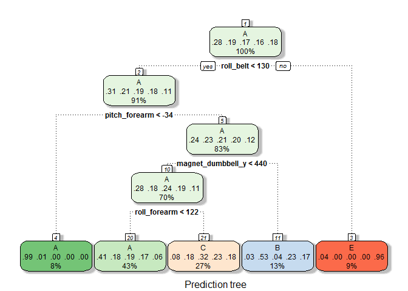

# Practical Machine Leraning
Aleksei Neverov  
4 мая 2016 г   


## Backgroung

Using devices such as Jawbone Up, Nike FuelBand, and Fitbit it is now possible to collect a large amount of data about personal activity relatively inexpensively. These type of devices are part of the quantified self movement – a group of enthusiasts who take measurements about themselves regularly to improve their health, to find patterns in their behavior, or because they are tech geeks. One thing that people regularly do is quantify how much of a particular activity they do, but they rarely quantify how well they do it. The goal of this project is to use data from accelerometers on the belt, forearm, arm, and dumbell of 6 participants. They were asked to perform barbell lifts correctly and incorrectly in 5 different ways. More information is available from the website here: [http://groupware.les.inf.puc-rio.br/har] (http://groupware.les.inf.puc-rio.br/har). 

## Data loading, exploratory analisys and data processing

For model training we load and open the training dataset:


```r
if (! file.exists("pml-training.csv")) {
      url <- "https://d396qusza40orc.cloudfront.net/predmachlearn/pml-training.csv" 
      download.file(url,"pml-training.csv")
}

trainingFull <- read.csv("pml-training.csv")
```

This datatest contains ``19622`` observations of ``160`` variables. We must predict the value of the **classe** variable, which is the factor variable with ``5`` levels:


```r
table(trainingFull$classe)
```

```
## 
##    A    B    C    D    E 
## 5580 3797 3422 3216 3607
```

First we split the dataset into two parts: the training dataset with 60% of the observations and the validating dataset with other 40% of the observations. Also we remove the very first seven variables, because they describe the observation but not the activity pattern itself:


```r
set.seed(753)

## remove the very first 7 variables
trainingFull <- trainingFull[,-(1:7)]

## split the dataset into two parts
inTrain <- createDataPartition(trainingFull$classe, p = 0.6, list = FALSE)
training <- trainingFull[inTrain,]
validate <- trainingFull[-inTrain,]
```

To prepare datasets for the training we decided to remove all variables, which have more than 50% of NA values:


```r
### calculate of the persentage of NAs in columns
colnas <- apply(training, 2, function(x) mean(is.na(x)) <= .5)

### removing variables with persentage of NAs more than 50%
training <- training[,colnas]
validate <- validate[,colnas]
```

For the next step we must to apply some technique to imput the NAs, but for the first we'll calculate number of NAs in columns after previous processing:


```r
## calculating the number of the variables, which don't have any NA
x <- apply(training, 2, function(x) mean(is.na(x)) == 0)

## compare the number of the same variables with the total count of the variables in the dataset
length(x) == dim(training)[2]
```

```
## [1] TRUE
```

As we can see, neither variable has a NA value, so we reject to apply any procedure for NAs imputting.

Next we decided to remove the variables having the near-zero variance:


```r
## get NZV-variables
nsv <- nearZeroVar(training,saveMetrics=TRUE)

## remove them from datasets
training <- training[,!nsv$nzv]
validate <- validate[,!nsv$nzv]
```

After all procedures we've got datasets ready for the model training. Both of them have the same number of the variables:


```r
dim(training)
```

```
## [1] 11776    53
```

```r
dim(validate)
```

```
## [1] 7846   53
```

## Training of the model

To select the best model for the prediction of the **classe** variable we explored some models. For the beginning we chose the model based on the **prediction tree**:


```r
############# Tree prediction ###########################

set.seed(753)

rpartModel <- train(classe ~ .,method="rpart", data=training)

fancyRpartPlot(rpartModel$finalModel, sub = "Prediction tree")
```



```r
predictValidate1 <- predict(rpartModel,newdata = validate)
cm1 <- confusionMatrix(predictValidate1, validate$classe)
```

This model has Accuracy = ``0.4922253`` (or ``49.223``%), so we reject to use it for further prediction.

The next model we explored is based on the **linear discriminant analysis (LDA)**:


```r
####################### LDA prediction ######################

set.seed(753)

ldaModel <- train(classe ~ .,method="lda2", data=training)

predictValidate2 <- predict(ldaModel,newdata = validate)

cm2 <- confusionMatrix(predictValidate2, validate$classe)
```

The LDA model has Accuracy = ``0.700102`` (or ``70.01``%), so we reject to use it for further prediction.

For the next model we decided to imput some covariates using methods of the **principial components analysis (PCA)**. Then we used LDA again to fit the prediction model:


```r
######################## PCA prediction + LDA ##################

set.seed(753)
n <- length(names(training))

## prepare training dataset for PCA creation
preProc <- preProcess(training[,-n],method=c("pca"),pcaComp=7)

## create covariates based on the PCA
trainingPC <- predict(preProc,training[,-n])

## imput the classe variable into the training dataset
classe <- training$classe 
trainingPC <- cbind(trainingPC, classe)

## aplly the same procedures to the validating dataset
validatePC <- predict(preProc,validate[,-n])
classe <- validate$classe 
validatePC <- cbind(validatePC, classe)

## train the model
pcaModel <- train(classe ~ .,method="lda", data=trainingPC)

predictValidate3 <- predict(pcaModel,newdata = validatePC)
cm3 <- confusionMatrix(predictValidate3, validate$classe)
```

The LDA model on the dataset with covariates, wich was created usuing PCA, has Accuracy = ``0.3364772`` (or ``33.648``%), so we reject to use it for further prediction.

For the next model we choose a **cross-validation of 4-folds** instead of bootstrap default method for **gradient boosting model (GBM)** in order to speed up training.


```r
##################### Cross-validation ####################### 

set.seed(753)

# create component to control the cross-validation

fitControl <- trainControl(method = "cv", number = 4)

# provide additionnal parameters to GBM

gbmGrid <-  expand.grid(interaction.depth = 1:3,
                        n.trees = (1:4)*100,
                        shrinkage = 0.1,
                        n.minobsinnode = 20)

cvModel <- train(classe ~. ,data = training ,method="gbm" ,trControl = fitControl ,verbose = FALSE,tuneGrid = gbmGrid)

predictValidate4 <- predict(cvModel,newdata = validate)
cm4 <- confusionMatrix(predictValidate4, validate$classe)
```

This model has Accuracy = ``0.9875096`` (or ``98.751``%) and the expected out-of-sample error by using this model is ``1.249``%. So we can conclude that its prediction ability is pretty high. If we'll not find the better model, we'll be able to use it for further prediction. But it would be better to become the model with 99%-Accuracy or higher. 

As the last model we decided to explore the one besed on the **random forest** with default parameters:


```r
################ Random forest #######################

set.seed(753)

rfModel <- train(classe ~ .,method="rf", data=training)

predictValidate5 <- predict(rfModel,newdata = validate)
cm5 <- confusionMatrix(predictValidate5, validate$classe)
```

This model has Accuracy = ``0.9909508`` (or ``99.095``%). The expected out-of-sample error by using this model = 100 - ``99.095``% = ``0.905``%. So we conclude that it is the best model and we'll use it for the prediction on the given testing dataset.

## Prediction with the testing dataset

To predict 20 values from the testing dataset we should load and prepare this dataset. After all procedures we'll become the same set of the predictors:


```r
############## Load and prepare testing dataset ##############################

## Loadingh dataset

if (! file.exists("pml-testing.csv")) {
      url <- "https://d396qusza40orc.cloudfront.net/predmachlearn/pml-testing.csv" 
      download.file(url,"pml-testing.csv")
}
testing <- read.csv("pml-testing.csv")

testing <- testing[,-(1:7)] ## Remove the very first seven variables
testing <- testing[,colnas] ## Remove variables having more than 50% of NAs
testing <- testing[,!nsv$nzv] ## Remove NZV-valiables

dim(testing)
```

```
## [1] 20 53
```

To predict the desired values we use the model based on the **Random Forest**:


```r
## Prediction for testing dataset with random forest
predictTest6 <- predict(rfModel,newdata = testing)
predictTest6
```

```
##  [1] B A B A A E D B A A B C B A E E A B B B
## Levels: A B C D E
```


Solely for the sake of interest we decided to use the model, based on the cross-validation to predict the desired values.Honestly we shouldn't do it because the accuracy of this model is less than 99%, but we've got the same result:


```r
## Prediction for testing dataset with cross-validation model
predictTest7 <- predict(cvModel,newdata = testing)
predictTest7
```

```
##  [1] B A B A A E D B A A B C B A E E A B B B
## Levels: A B C D E
```

## Summary

According the project task we explored some prediction models. The best result was shown by the model with random forest: this model gives accuracy = ``0.9909508`` (or ``99.095``%) and has hhe expected out-of-sample error ``0.905``%. Also we can say that cross-validation's methods can be useful too, but it's very important to select correct values of their parameters.

